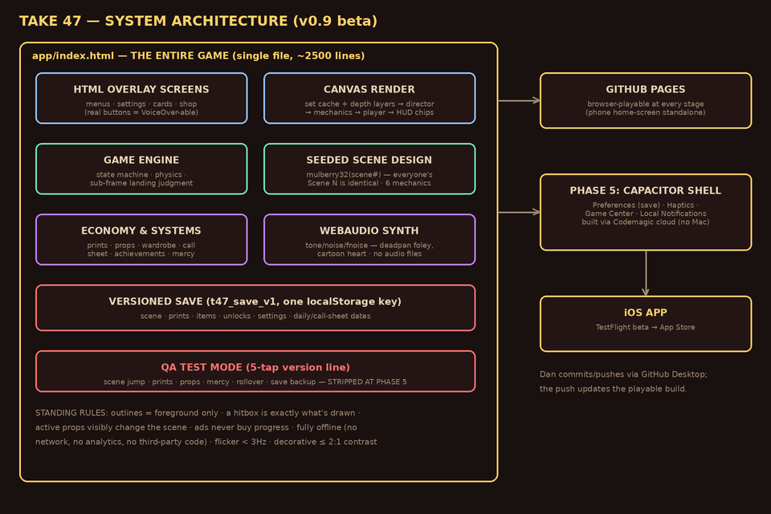
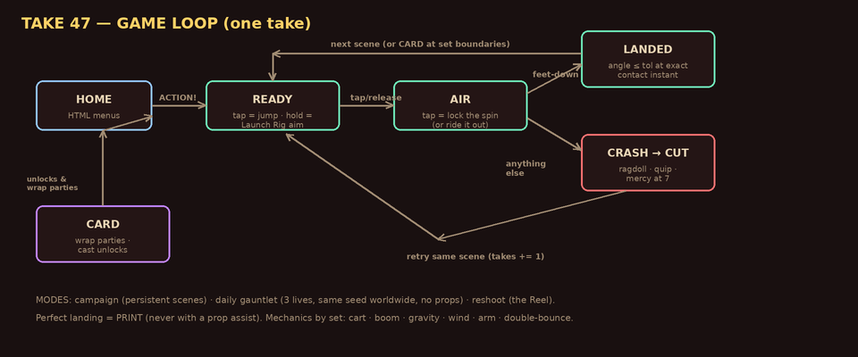

# ARCHITECTURE.md — how TAKE 47 works (plain language + diagrams)

For the map of ALL docs see [README.md](README.md). This one explains the code. Diagrams regenerate via `python3 tools/render_docs_diagrams.py` — rerun whenever this document changes materially (MAINTENANCE.md checks they still match reality).

## The one-file game

Everything is `app/index.html` — one file a browser (and later the Capacitor iOS shell) can run with zero build steps. Inside, in file order: config constants → save system → seeded scene design → characters/wardrobe → prop department → audio synth → engine → UI wiring → render code (bulky set art lives at the file's tail on purpose — see CLAUDE.md's read-cap note).

**Why one file?** No build pipeline to break, trivially deployable (a git push IS the deploy), and provably sufficient at this scope. It splits only if Phase 5 forces it.

### The pieces, in plain language

- **HTML overlay screens** — home, settings, shop, cards are real HTML buttons, *not* canvas drawings. That's what makes menus work with VoiceOver and keyboards for free. The canvas only ever renders gameplay.
- **Canvas render** — each set's static art (sky, depth layers, props, floor) is drawn ONCE into an offscreen cache; per frame we stamp that cache, then draw only what moves: the director's reactions, mechanics (cart/boom/arm/wind/wires), the player, and HUD chips. That's why six layered backgrounds cost nothing at runtime.
- **Seeded scene design** — Scene N is generated from the number N through a deterministic random generator (mulberry32), so every player's Scene 12 is identical, forever, with no level data stored anywhere. The daily gauntlet does the same with the date — "same gauntlet for everyone" costs zero servers.
- **Game engine** — a small state machine (diagram below) plus simple projectile physics. Landings are judged by body angle at the *exact* sub-frame instant of ground contact.
- **Economy & systems** — prints (earned only), props (consumables with scene-relevance gating), wardrobe, call sheet, achievements, mercy. One invariant everywhere: **assistance never PRINTS, money never buys progress.**
- **Audio** — synthesized live from oscillators and filtered noise ("deadpan foley, cartoon heart"). No audio files exist.
- **Save** — one versioned localStorage blob (`t47_save_v1`), written after anything meaningful, with legacy migration. The Phase 5 hard gate SHIPPED (build 7): every persist() also mirrors the blob to Capacitor Preferences, and boot restores it if iOS purged WebView storage (pure no-op in browsers).
- **QA Test Mode** — hidden panel (Settings → 5 taps on the version line) that sets test-prerequisite states. Hard gate: stripped before App Store submission.

## The game loop

One take: **READY** (tap to jump — or, with a Launch Rig armed, hold to aim power) → **AIR** (tap once to lock the spin, or ride it out) → judged at ground contact → **LANDED** advances the scene (interstitial **CARD**s at set boundaries) or **CRASH → CUT** with a director quip and instant retry. Three modes share this loop: campaign (persistent), daily gauntlet (3 lives, no props), reshoot (the Reel).

## Standing invariants (change these only by DECISIONS.md entry)

1. **Outlines mark foreground only** — depth layers never get outlines and stay ≤2:1 contrast vs their sky.
2. **A hitbox is exactly what's drawn** — collision shapes match visuals (boom mic, arm), and landings are judged at the drawn contact instant.
3. **An active prop visibly changes the scene** — never physics-only effects.
4. **Ads never buy progress; assisted takes never PRINT.**
5. **Fully offline** — no network calls, analytics, identifiers, or third-party code (Phase 5 adds Apple-operated services only: Game Center, local notifications, haptics).
6. **Accessibility floor** — color never signals alone; luminance flicker <3Hz; reduce-motion honored; sound optional; lethal hazards ≥3:1 contrast on every set (audited: BRAND.md).

## Verification approach

Headless: logic replicas + stubbed-canvas smoke tests run in a sandbox before anything reaches Dan's phone, driven by **real state sequences** (a synthetic-input test once hid an unreachable branch). On-device: QA-PLAN.md sessions using Test Mode. The mount read-cap workarounds and mirror-drift lessons live in CLAUDE.md — the Read tool is always the authority on this file.

## Phase map

0–4 ✅ (idea → prototype → design → full build, art, sound, systems) · **5 ◐** Capacitor wrap, Preferences migration, Game Center/notifications/haptics, QA strip, hello-world TestFlight (PIPELINE.md is the runbook) · **6** App Store submission (metadata, screenshots, review).
