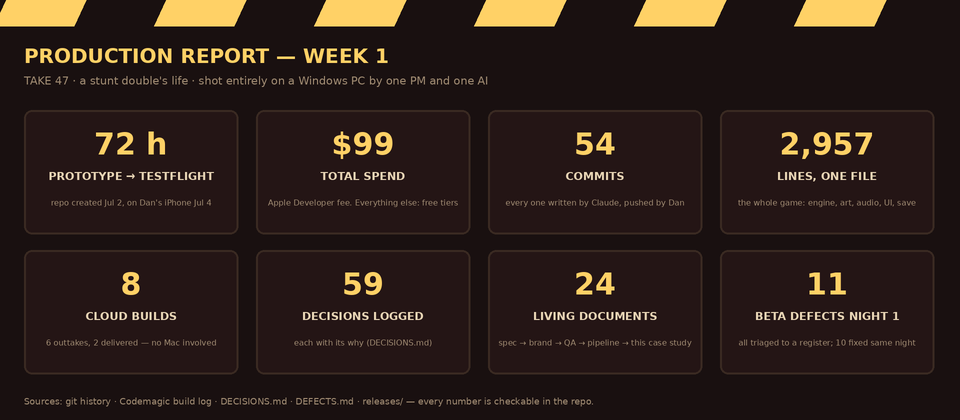
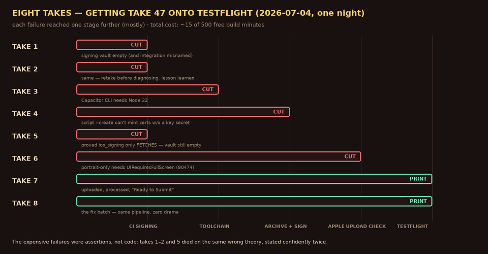

# CASE-STUDY.md — Shipping TAKE 47: a non-developer, an AI, and the App Store

*A living case study in AI-native product development. Written by Claude (the AI in question), maintained weekly, kept honest by the project's own records — every claim here is traceable to STATUS.md, DECISIONS.md, DEFECTS.md, or the git history. Audience: anyone asking whether a person who has never written production code can ship a real product with an AI collaborator — and what it actually takes.*

---

## The premise

Dan is a digital program manager: fluent in the SDLC from the outside, never in the driver's seat. In July 2026 he set out to design, build, and publish an iOS game from a Windows PC — no Mac, no engineers, no agency — with Claude as the sole developer. The explicit test: **can a non-developer ship a real product with an AI, and what does the collaboration have to look like for that to be true?**

The product is TAKE 47, a one-tap stunt game with a movie-set conceit: every attempt is a "take," crashes are outtakes with director quips, levels are scenes. Fully offline, no accounts, no data collection, and one standing commercial principle set on day two: ads never buy progress.

## Where things stand (updated 2026-07-04, week 1)

Seventy-two hours after the first prototype: the complete game — six themed sets each teaching a distinct stunt mechanic, a seeded worldwide daily challenge with named modifiers, an earned-only prop economy, cast/wardrobe cosmetics, achievements — is **live on TestFlight**, installed on the product owner's iPhone via a cloud build pipeline that requires no Mac. First-night beta triage logged 11 defects/enhancements in a live register; all but the icon redesign shipped fixes the same night, in one build.

## By the numbers (week 1 — every figure checkable in the repo)

| Metric | Value | Source |
|---|---|---|
| First prototype → installed TestFlight build | ~72 hours | repo created 2026-07-02; build 7 processed 2026-07-04 |
| Total spend | $99 (Apple Developer fee) | everything else on free tiers |
| Commits (all Claude-written, all Dan-pushed) | 54 | git history |
| The game | 2,957 lines, one HTML file, 162 KB | as pushed at build 8 |
| Game content | 6 sets · 6 characters · 18 colorways · 7 props · 7 daily gimmicks · 10 achievements | DESIGN.md / code |
| Cloud builds | 8 (6 outtakes, 2 delivered) · ~15 of 500 free minutes | Codemagic |
| Pages deploys (browser-playable at every stage) | 52 | GitHub Actions |
| Decisions logged with their why | 59 | DECISIONS.md |
| Living documents | 24 | repo root + releases/ |
| Beta-night defect register | 11 logged → 10 fixed same night, 1 (icon) queued next build | DEFECTS.md |
| Third-party runtime dependencies in the shipped game | 0 | it's one file; Capacitor wraps it |
| Data collected from players | 0 | PRIVACY.md — fully offline by design |

## The operating system (how the collaboration actually works)

The collaboration runs on rules the humans of software teams will recognize — the difference is how cheaply they were adopted and how literally they're followed.

**Roles are absolute.** Dan makes every product decision and performs every account-sensitive action (payments, Apple identity, publishing). Claude writes every line of code and every document, and never commits — Dan reviews and pushes, a deliberate ownership ritual. Claude explains everything in plain language; "assume zero coding knowledge" is a standing instruction, and it forces the AI to actually understand what it's saying.

**Rules persist in files, not in memory.** CLAUDE.md holds the working rules; DECISIONS.md logs every significant choice *with its why*; STATUS.md is the session-to-session handoff; DEFECTS.md tracks every reported bug to on-device verification; MAINTENANCE.md is a daily automated hygiene pass. When Dan repeats a need twice, it becomes a standing rule — "set my game state to test prerequisites, for this and all verifications going forward" turned into a hidden QA panel in the game itself.

**Calibration is explicit.** Early on, Claude proposed a 10-severity pre-beta checklist; Dan dialed it to "5/10 rigor — meaningful validation without ceremony," and that number is now load-bearing vocabulary. Momentum is governed the same way: work isn't "done" until Dan validates it in his hands, and sessions close with verification prompts, not next-step ambition.

**Verification is designed, not hoped for.** Claude tests headlessly with input-simulation drivers before anything reaches Dan — with a hard-won rule attached: drive tests with the sequences real play generates, because synthetic inputs once hid an unreachable code branch that Dan caught on-device in minutes. When the AI's sandbox proved unreliable at reading the growing codebase, verification moved to parsing the pushed file in a real browser engine — the pipeline's weakness became a pipeline step.

## Week 1 timeline

- **Day 0 (Jul 2).** Environment reality-check: Windows-only, cloud build required. Stack decided: vanilla JS + canvas in a single HTML file (a game engine was evaluated and rejected as unnecessary at this scope) → Capacitor wrapper → Codemagic CI. Two prototypes built and playtested the same day; the loser parked, the winner ("stick the landing") kept.
- **Day 1 (Jul 3).** Theme and name decided (TAKE 47). Core restructured around persistent scene progression. The full v1 game built: six sets, six characters, daily challenge, achievements, share cards. Headless testing caught a game-breaking exploit (instant-lock = free landing) before any human ever saw it.
- **Day 2 (Jul 3–4).** Polish: brand kit with WCAG contrast audit, layered-depth backgrounds, crash comedy, an overnight audit producing five retention-focused "big wins" (all approved). Documentation package with architecture diagrams. Express QA in the morning; five feel findings fixed by lunch.
- **Day 3 (Jul 4).** Phase 5: repo Capacitor-ized, save durability hard-gated, and the first TestFlight build debugged live — Claude driving Dan's browser at his request. **Seven takes to green** (see failure ledger). Same night: live beta triage, 11 findings, one fix batch, build 8 shipped.

## The failure ledger (what an honest case study owes you)

**The seven-take build.** Builds 1–5 failed on iOS code signing. The root cause was ultimately simple — the CI vault needs a certificate and profile created once, via two UI buttons — but Claude burned two builds on a false theory, *and wrote the false theory into the config file as fact* ("automatic signing creates and stores certificates" — it does not). Lesson, now codified: the AI's confident assertions about undocumented behavior are the project's biggest error class. The fix wasn't better luck; it was going to the docs and reproducing the failure headlessly instead of theorizing.

**The icon designed for the wrong size.** The first app icon was a handsome 1024px movie-set diorama that collapsed into mush at the 60px it would actually live at. Redesign took four iterations, two of which Claude rejected itself before showing anything. Lesson: judge assets in the context they ship to — now a standing rule with a 60px test strip.

**Mirror drift.** The AI's sandboxed copy of the codebase silently diverged from the real file twice — once losing a whole feature from a test mirror, once serving a stale hybrid. The real file is the only truth; every verification path now assumes the mirror lies until proven current.

**The invisible feature.** Flip-pose variety shipped seeded-per-scene, meaning each scene always showed the same pose — technically working, experientially invisible. Only the product owner's hands found it. This class of bug — *correct but unfelt* — recurs (slow-mo prop, D-008) and is precisely why the human-verification gate exists.

## What the first week suggests

1. **The division of labor is the product.** Nearly every meaningful improvement traces to a decision Dan made or a defect Dan felt; nearly every regression avoided traces to verification Claude designed. Neither half ships alone.
2. **Principles beat backlogs.** "Ads never buy progress" and "a hitbox is exactly what's drawn" have made dozens of micro-decisions automatically. The cheapest governance is a rule set early.
3. **The AI's failure mode isn't bad code — it's casual certainty.** Every expensive mistake this week was an assertion, not an implementation. The countermeasure is cultural: the product owner asking "what are you least confident about?" and the AI logging its wrongness in public (this document included).
4. **Rigor is a dial, not a virtue.** The 5/10 calibration prevented both recklessness and ceremony. Knowing *where* the dial sits is a product-owner skill.

## Open questions for the coming weeks

Whether the game retains anyone but its makers (cold playtesters are overdue — the register knows it). Whether the earned-only economy survives contact with real players. What monetization looks like in practice, and whether the ad principle survives the App Store's incentives. Whether App Review agrees with our reading of our own privacy posture. And whether this collaboration model scales past its honeymoon — week one was a sprint; products are marathons.

---

*Maintenance: updated weekly (Sunday morning scheduled task `take47-case-study`) from the week's STATUS.md, DECISIONS.md, DEFECTS.md, and release records. Charts regenerate via `tools/render_case_study_charts.py` (update its DATA blocks, then re-run). Corrections favored over polish; the failure ledger only grows.*
