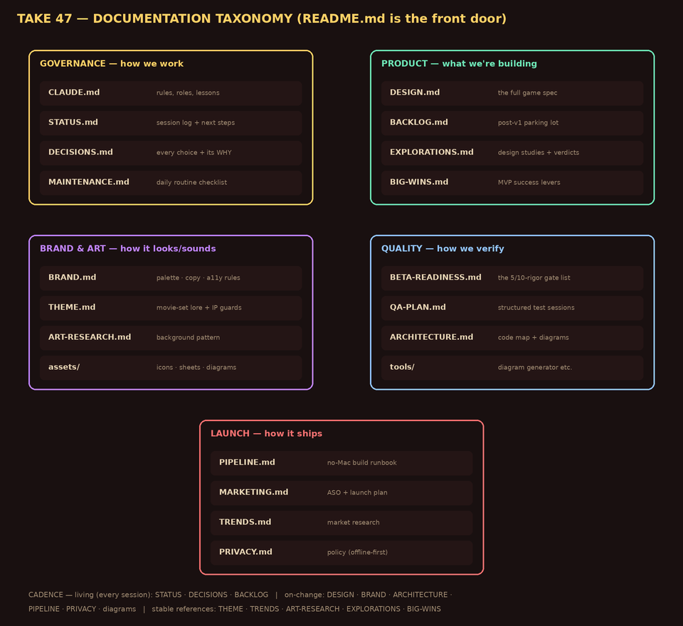

# TAKE 47 🎬

*A one-tap stunt game. Every attempt is a take. Every crash is an outtake. The director has opinions.*

Built by **Dan** (product owner) and **Claude** (lead developer) — an experiment in whether a non-developer can ship a real App Store product with an AI collaborator. Browser-playable at every stage via GitHub Pages; heading to iOS via Capacitor + Codemagic (Phase 5).

**Play it:** open the GitHub Pages URL for this repo → `app/` (add to home screen on iPhone for the standalone version).

## The documentation package

Everything lives in this repo, organized in five groups. **Start here, then follow the map:**

| Group | Doc | What it holds | Update cadence |
|---|---|---|---|
| **Governance** | [CLAUDE.md](CLAUDE.md) | Working rules, roles, operational lessons | on new lessons |
| | [CASE-STUDY.md](CASE-STUDY.md) | Honest living case study of the AI-native collaboration | **weekly (Sun)** |
| | [STATUS.md](STATUS.md) | Session log + current next steps | **every session** |
| | [DECISIONS.md](DECISIONS.md) | Every significant choice and its *why* | **every session** |
| | [MAINTENANCE.md](MAINTENANCE.md) | The routine checklist (automated daily) | on process change |
| **Product** | [DESIGN.md](DESIGN.md) | The complete game spec | on scope change |
| | [BACKLOG.md](BACKLOG.md) | Post-v1 parking lot (ideas go here, not into v1) | **every session** |
| | [EXPLORATIONS.md](EXPLORATIONS.md) | Design studies with options + verdicts | per study |
| | [BIG-WINS.md](BIG-WINS.md) | The five MVP success levers + status | on status change |
| **Brand & Art** | [BRAND.md](BRAND.md) | Palette, copy registers, set palettes, a11y color rules | on identity change |
| | [THEME.md](THEME.md) | Movie-set lore + IP guardrails | stable |
| | [ART-RESEARCH.md](ART-RESEARCH.md) | The layered-background pattern + per-set plans | stable |
| | `assets/` | Icon, brand sheets, studies, these diagrams | as produced |
| **Quality** | [ARCHITECTURE.md](ARCHITECTURE.md) | Code map, diagrams, invariants | on structural change |
| | [BETA-READINESS.md](BETA-READINESS.md) | The calibrated (5/10 rigor) gate list to TestFlight | per gate |
| | [QA-PLAN.md](QA-PLAN.md) | Structured test sessions w/ Test Mode steps | per session plan |
| | [DEFECTS.md](DEFECTS.md) | Defect register: report → root cause → fix → verified | **on every report** |
| | `tools/` | `render_docs_diagrams.py` (regenerates the diagrams) | with diagrams |
| **Launch** | [PIPELINE.md](PIPELINE.md) | The no-Mac build runbook (Capacitor + Codemagic) | Phase 5 |
| | [CHANGELOG.md](CHANGELOG.md) | Engineering changelog, one entry per shipped build | per build |
| | [`releases/`](releases/) | Per-build record: release notes, QA report, known issues, store metadata | per build |
| | [MARKETING.md](MARKETING.md) | ASO + launch plan ("the fail is the ad") | pre-launch |
| | [TRENDS.md](TRENDS.md) | Market research snapshot | stable |
| | [PRIVACY.md](PRIVACY.md) | Privacy policy (offline-first) | on any SDK change |

## Ground rules (the short version)

Ads never buy progress. Perfects are earned raw. The game is fully offline — no analytics, no identifiers, no third-party code. Accessibility is a standing design constraint, not a pass. Claude never commits — Dan reviews every diff and pushes via GitHub Desktop, and that push *is* the deploy. All of it in detail: [CLAUDE.md](CLAUDE.md).

## Where things stand

Always current in [STATUS.md](STATUS.md) — latest entry top of the log, next steps at the bottom.
